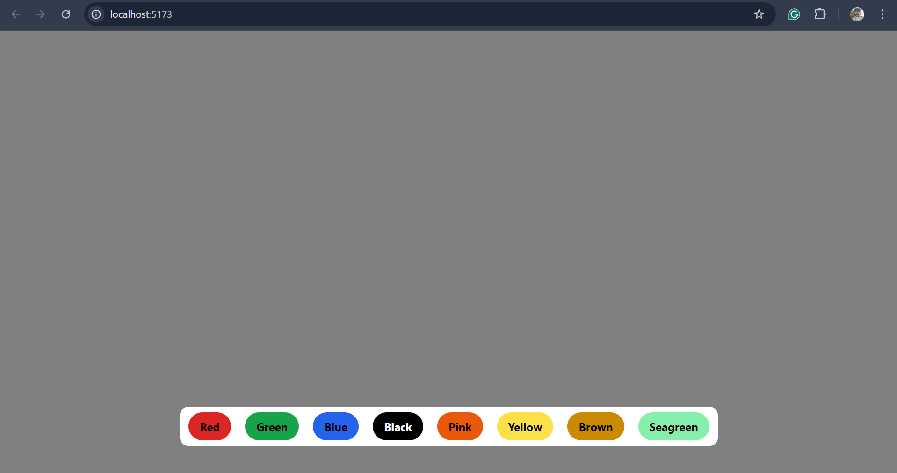
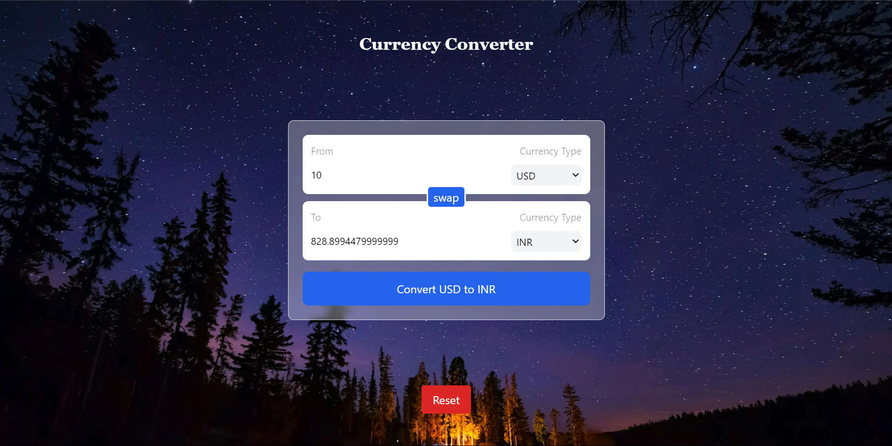
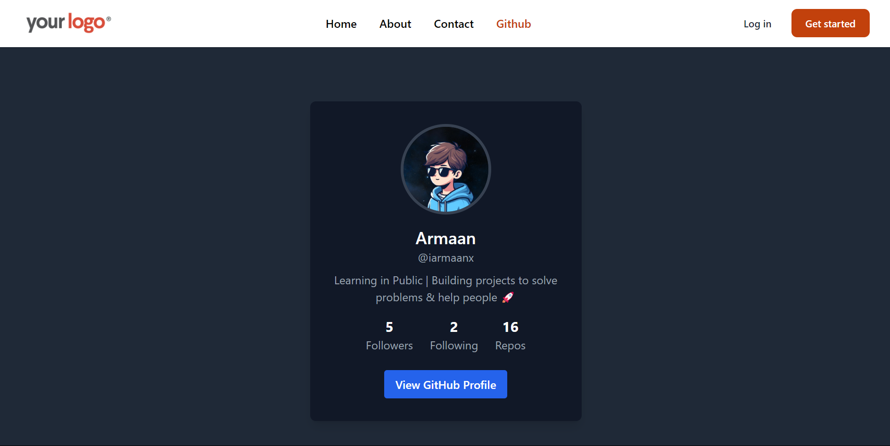

# Learn React

This repository contains the code and notes from my React learning process.

## Approach

- **Introduction to React**: Basics of React and its core concepts.
- **Components**: Examples of functional and class components.
- **JSX**: Writing React components using JSX.
- **Props and State**: How to use props and manage state in React.
- **Hooks**: Learning React hooks like `useState` and `useEffect`.
- **Projects**: Small projects and exercises to apply React knowledge.

## Resources

YouTube playlist - <https://www.youtube.com/playlist?list=PLu71SKxNbfoDqgPchmvIsL4hTnJIrtige>  
Official React Docs - https://react.dev/learn

## Projects made

1. Bg Changer

From this project I learnt how to use useState hook in project, state management and how the function updates the state.

2. Password Generator

In this project I learnt how to use useCallback Hook, useState, useRef and useEffect hook.  
useCallback - here I used for optimization, to cache function in the memory. , 
useEffect - to run the function if any dependency changes.  
useState - all the state management is done using useState hook.   
useRef - to take reference of password while copying it to clipboard.   
Method used to copy value to clipboard - window.navigator.clipboard.writeText()  
Here **Length** = password size  
**Numbers** = to include numbers  
**Symbols** = to include symbols  

3. Currency Convertor

Intialized the project, learning hook to create a custom hook.  
Custom Hook - At the end of the day hooks are just functions returning some values. So we can also create our own custom hooks.    
Installed "ES7+ React/Redux/React-Native snippets" extension which allows you to use shortcuts in React.   
Learn more- https://marketplace.visualstudio.com/items?itemName=dsznajder.es7-react-js-snippets  
After creating the custom hook, I created a new jsx component `InputBox.jsx`    
Took some props like label, currencyOptions, amount and then used '.map' method to get options in the select list.  
Learned `useId Hook` - which creates a unique ID for elements.
Here I used .map method to map the list of currenices.   
Object.keys() method to get those names of currenices from API data. 
Always add a error handling while calling a API, sometimes API call gives error and we didn't get to know.
I also added a Reset button to reset the app with initial values.

4. React Router

React Router Official Docs : https://reactrouter.com/en/main

In this project I learnt about Routing. I used to the command `npm i react-router-dom` to install React Router DOM. We don't use anchor tag in React because that reloads the whole page that makes no sense in React.  
Created a Layout.jsx file which defines the structure of static and dynamic files. 
Used RouterProvider in main.jsx which takes path, element as props.
Learnt the two ways of creating the Router elements. 
Learnt a very cool thing with urls. You can pass anything(it can be text or numbers) in the url and access that in your elements. It's very intersting concept while designing user admin pages.
 
Used github API to get data from Github and made a API call in loader attribute of the Router tag jsut to optimize the API call time. 

 
Learnt about how different pages(elements) are injected in the nesting of Router.

 
 
** ⬇️ I haven't uploaded these projects on Netlify but if you want to run them on your local machine.**  
It's simple.  

1. Download the project file.
2. Choose the project you want to run.  
`cd projectName`
3. Run this command in terminal:  
`npm i`  
4. And then  
`npm run dev`

If you found this repository useful give it a star :)

 

---

_Written with ❤️ by Armaan Singh_
